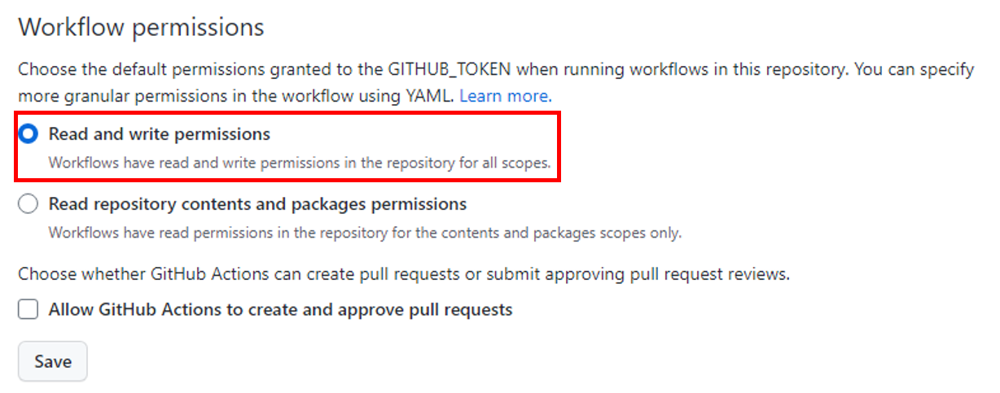
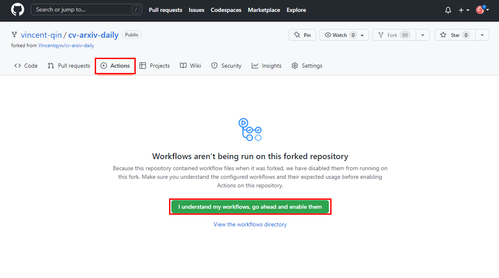
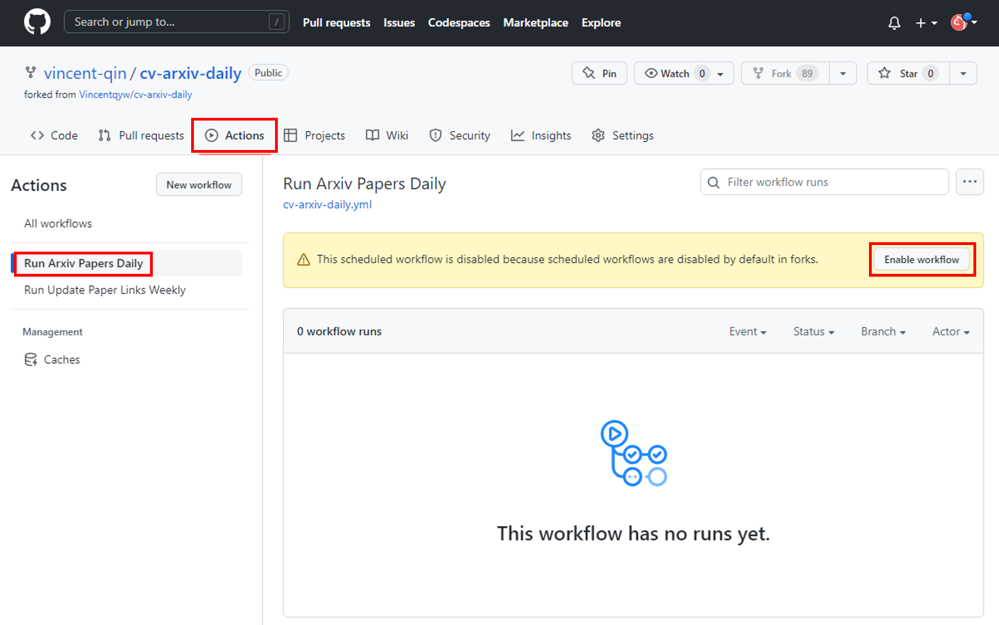
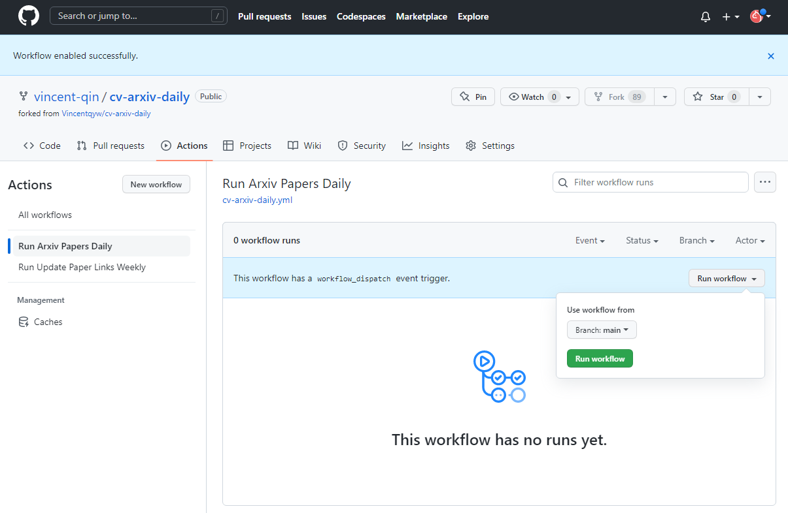
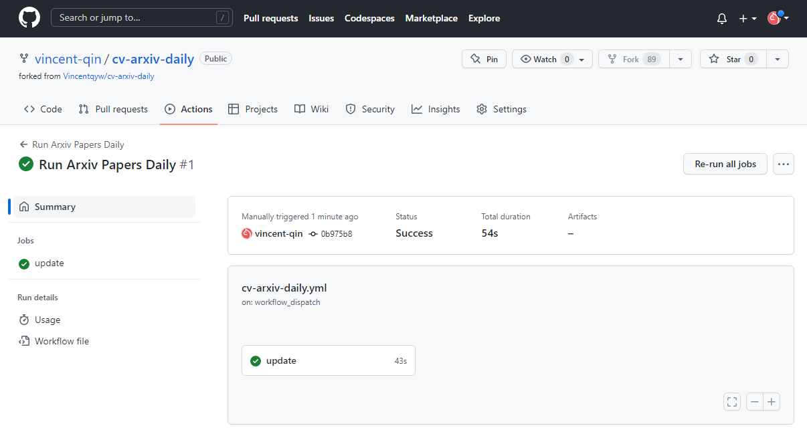
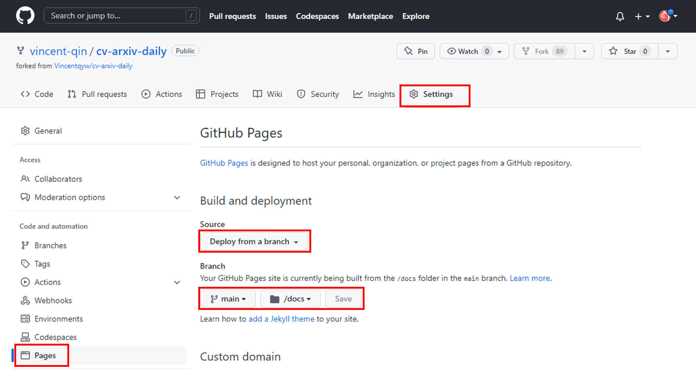

  <h1 align="center"> <ins>CV-ARXIV-DAILY</ins> Automatically Update CV Papers Daily using Github Actions</h1>
 

##

This repository hosts the source code for cv-arxiv-daily, an useful sripts to fetch arxiv paper daily. 

## Overview

This codebase is composed of the following parts:

- `daily_arxiv.py`: main scripts to processing given configurations
- `config.yaml`: configuration file of papers' keywords etc.

## Usage

  
Table of Contents

1. Fork this [repo](https://github.com/Vincentqyw/cv-arxiv-daily)
2. Edit configs:
    - Change `GITHUB_USER_NAME` and `GITHUB_USER_EMAIL` in [cv-arxiv-daily.yml](../.github/workflows/cv-arxiv-daily.yml) and [update_paper_links.yml](../.github/workflows/update_paper_links.yml)
    - Change `user_name` in [config.yaml](../config.yaml)
    - Push changes to remote repo
3. Config Github Actions
    - Enable read and write permissions: Setting -> Actions -> Workflow permissions, select `Read and write permissions` and save.
    
    - Enable workflows: Actions -> `I understand my workflows, go ahead and enable them` -> Select `Run Arxiv Papars Daily` in right sidebar and click `Enable workflow` -> click `Run workflow` wait about 1 min until the job update done. The same for the job `Run Update Paper Links Weekly`.
    
    
    
    
    
4. Setting Gitpages (optional)
    - Setting -> Pages -> Build an deployment. Source: `Deploy from a branch`; Branch select `main` and `/docs` folder, then save.
    
    - Now you can open gitpage: https://your_github_usrname.github.io/cv-arxiv-daily
5. Add new keywords (optional)
    - Edit `keywords` in [config.yaml](../config.yaml), you can add more filters or keywords.
    - Push changes to remote repo and re-run Github Actions Manually.

## Release plan

 We are still in the process of fully releasing. Here is the release plan:

- [x] Configuration file
- [x] Update code link
- [ ] Subscribe & Update alerting
- [ ] Support more `arxiv` filters
- [ ] Archive old papers
- [ ] Language translation ([`ChatGPT`](https://chat.openai.com/chat))
- [ ] Usefull comments
- [ ] ...
